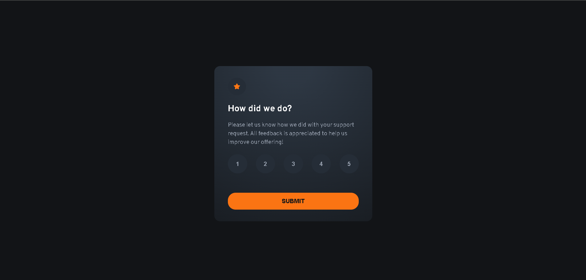

# Frontend Mentor - Interactive rating component solution

This is a solution to the [Interactive rating component challenge on Frontend Mentor](https://www.frontendmentor.io/challenges/interactive-rating-component-koxpeBUmI). Frontend Mentor challenges help you improve your coding skills by building realistic projects.

## Table of contents

- [Overview](#overview)
  - [The challenge](#the-challenge)
  - [Screenshot](#screenshot)
  - [Links](#links)
- [My process](#my-process)
  - [Built with](#built-with)
  - [What I learned](#what-i-learned)
  - [Continued development](#continued-development)
  - [Useful resources](#useful-resources)
  - [AI Collaboration](#ai-collaboration)
- [Author](#author)
- [Acknowledgments](#acknowledgments)

## Overview

### The challenge

Users should be able to:

- View the optimal layout for the app depending on their device's screen size
- See hover states for all interactive elements on the page
- Select and submit a number rating
- See the "Thank you" card state after submitting a rating

### Screenshot



### Links

- Solution URL: [GitHub Repositery](https://github.com/dawudasasfeh/Interactive-rating-component)
- Live Site URL: [Interactive rating component](https://dawudasasfeh.github.io/Interactive-rating-component)

## My process

### Built with

- Semantic HTML5 markup
- CSS custom properties
- Flexbox
- Vanilla JavaScript

### What I learned

I learned how to create gradient backgrounds and when to use `background-image` instead of `background-color`. A solid `background-color` gives a flat look, while a gradient with `background-image` adds depth and makes the card feel more polished and modern.

```css
.card {
  /* background-color: var(--grey-900); */
  background-image: radial-gradient(
    120% 120% at 50% 0%,
    hsl(213, 19%, 22%) 10%,
    var(--grey-900) 42%,
    var(--grey-950) 125%
  );
}
```

### Continued development

My next step is learning React and continuing to build small projects to gain more hands-on experience, just like I did with this challenge.

### Useful resources

- [W3Schools: CSS Gradients](https://www.w3schools.com/css/css3_gradients.asp) - This helped me better understand gradient syntax, color stops, and the difference between linear and radial gradients.

### AI Collaboration

I used GitHub Copilot to help me create and refine the gradient background styles for the card component.

## Author

- Website - [Dawud Alasasfeh](https://dawudasasfeh.github.io)
- Frontend Mentor - [@dawudasasfeh](https://www.frontendmentor.io/profile/dawudasasfeh)
